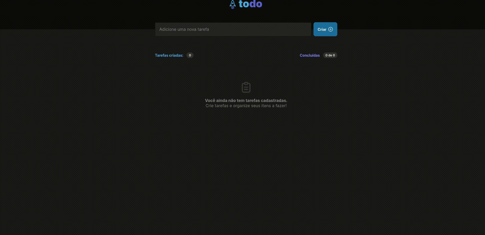

<h2>ReactJS_ToDoList | Ignite - Praticando conceitos básicos reactJS [Desafio 01] </h2>

[PT-BR]💻 ToDoList | Projeto front-end reactjs desenvolvido ao decorrer do curso da rocketseat[ignite]

<h3>🚀 Tecnologias utilizadas </h3>
<ul>
  <li> ReactJS </li>
  <li> TypeScript </li>
</ul>
<h3>ℹ️ Informações adicionais </h3>
<ul>
  <li>Projeto desenvolvido apenas front-end</li>
 </ul>

[ ENG ]💻 ToDoList | Reactjs front-end project developed during the course of rocketseat[ignite]

<h3>🚀 Technologies used </h3>
<ul>
  <li> ReactJS </li>
  <li> TypeScript </li>
</ul>
<h3>ℹ️ Additional Information </h3>
<ul>
  <li>Project developed only front-end</li>
 </ul>

<h3>Preview:</h3>

 
  

